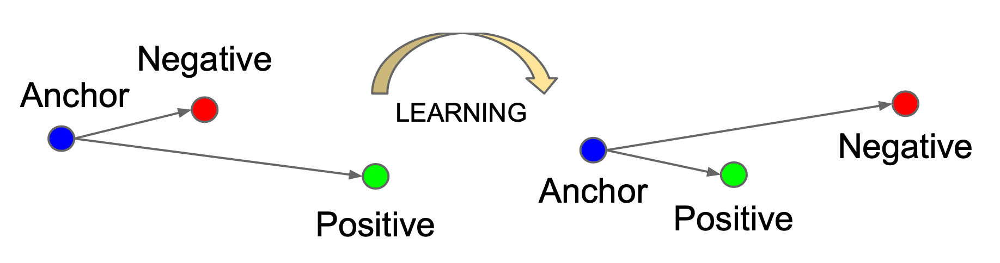

<!--
_header: ''
_footer: ''
_paginate: false
_class: invert
-->
# Visual Object Tracking
## ... with focus on **Siamese neural networks** 
## ... and **lessons learned** during my Ph.D. research

*(Ph.D. thesis defense takes place on 23. 8. 2022)*

### ***Milan Ondrašovič***
*milan.ondrasovic@gmail.com*
***University of Žilina**, Žilina, Slovakia*
*Faculty of Management Science and Informatics*
*Department of Mathematical Methods and Operations Research*
\
Date of presentation: 22. 06. 2022

---
<!--
_header: ''
_footer: ''
_paginate: false
_class: invert
-->
# *Part 1*: **Similarity learning** and **Siamese networks**

## ... the **necessary** theoretical **background**.

---
<!--
header: '*Part 1*: Introduction to **Similarity learning** and **Siamese neural networks**'
_footer: '**[1]** - *Bromley, Jane, et al.* "[Signature verification using a 
Siamese time delay neural network.](https://proceedings.neurips.cc/paper/1993/hash/288cc0ff022877bd3df94bc9360b9c5d-Abstract.html)" Advances in NIPS (1993).'
-->
# Similarity learning

* **Similarity learning** started as **signature verification** [[1](https://proceedings.neurips.cc/paper/1993/hash/288cc0ff022877bd3df94bc9360b9c5d-Abstract.html)].
* The **goal** is to **train** the model to discern between **similar** and **dissimilar** object.
* The notion of **similarity** is **task-specific** as well as the way to **measure** it.

---
<!--
_footer: '**[1]** - *Zagoruyko, Sergey, and Nikos Komodakis.* "[Deep compare: A study on using convolutional neural networks to compare image patches.](https://www.sciencedirect.com/science/article/pii/S1077314217301716?casa_token=vC_LQ_Cqk0gAAAAA:gocpeGZRSaJH7HTFVdyN-GVjAPJo46R4ZCcYANYlhO4j0yyofFHcSnHuzTTJJRj8axmECChxwQ)" CV and Image Understanding 164 (2017): 38-55.
'
-->
# Siamese networks

* In general, employed for **information retrieval** tasks.
* Frequently used approach to **similarity learning**.
* They often come in a form of a "**Y-shaped**" network.
* There are **various types** from the **weight sharing** perspective [[1](https://www.sciencedirect.com/science/article/pii/S1077314217301716?casa_token=vC_LQ_Cqk0gAAAAA:gocpeGZRSaJH7HTFVdyN-GVjAPJo46R4ZCcYANYlhO4j0yyofFHcSnHuzTTJJRj8axmECChxwQ)].

---
<!--
_footer: '
**[1]** - *Kuma, Ratnesh, et al.* "[Vehicle re-identification: an 
efficient baseline using triplet embedding.](https://arxiv.org/abs/1901.01015)" 2019 International Joint Conference on Neural Networks (IJCNN). IEEE, 2019.

**[2]** - *Wei, Wenyu, et al.* "[Person re-identification based on deep learning-An overview.](https://www.sciencedirect.com/science/article/pii/S1047320321002765)" Journal of Visual Communication and Image Representation (2021): 103418.

**[3]** - *Bertinetto, Luca, et al.* "[Fully-convolutional siamese networks for object tracking.](https://arxiv.org/abs/1606.09549)" European conference on computer vision. Springer, Cham, 2016.
'
-->
# Siamese networks and similarity learning

* A common use-case is to **estimate** a **degree** of **similarity** between **two images**.
* Domain of object **Re-identification** (**ReID**).
  * E.g., vehicle ReID [[1](https://arxiv.org/abs/1901.01015)], person ReID [[2](https://www.sciencedirect.com/science/article/pii/S1047320321002765)].
* Domain of **Siamese tracking** [[3](https://arxiv.org/abs/1606.09549)].

---
# Computing embedding vector similarity

Let $\mathbf{u}, \mathbf{v} \in \mathbb{R}^D$ be two arbitrary $D$-dimensional **vectors**.

## Cosine similarity

$$\cos \angle \left( \mathbf{u}, \mathbf{v} \right) = \cos \left( \theta \right) = \frac{\mathbf{u} \cdot \mathbf{v}}{\left\Vert \mathbf{u} \right\Vert_2 \left\Vert \mathbf{v} \right\Vert_2}$$

## (Squared) Euclidean distance

It's **squared form** is **proportional** to **cosine similarity** if both vectors are **normalized**.

$$\left\Vert \mathbf{u} - \mathbf{v} \right\Vert^2_2 = \sum_{i = 1}^{D} {\left( \mathbf{u}_i - \mathbf{v}_i \right)}^2 = 2 - 2 \cos \angle \left( \mathbf{u}, \mathbf{v} \right)$$ 

---
# Contrastive loss function

* This **mapping** should preserve **neighborhood relationships** between data points.
* **Generalization** to new, **unseen** data is **desired**.
* Excellent performance on **unsupervised learning** tasks.

---
<!--
_footer: '**[1]** - *Hadsell, Raia, Sumit Chopra, and Yann LeCun*. "[Dimensionality reduction by learning an invariant mapping.](https://ieeexplore.ieee.org/abstract/document/1640964?casa_token=s5-7Pr7LQAUAAAAA:MHfP_GruBRcXb37YixRLuvY4KkDGzZnVksgvBJBlHXsl2gtOOxqYkyHPl4lSuV4b9Iyjb6n2Ec2n)" 2006 IEEE Computer Society Conference on CVPR (CVPR-06). Vol. 2. IEEE, 2006.' 
-->

# Contrastive loss function

* Consider a sample $\left( x_0, x_1, y \right)$, where $x_0$, $x_1$ represent **features**, and $y$ is the **label**.

$$y = \begin{cases}
  1 \quad \text{if } x_0 \text{ and } x_1 \text{belong to the same category},\\
  0 \quad \text{otherwise}.
\end{cases}$$

* Let $\tilde{x}_0 = f_\theta \left( x_0 \right)$ and $\tilde{x}_1 = f_\theta \left( x_1 \right)$ be the **embedding vectors**.
* Let $\alpha$ be the **margin** of separation and $D \left( \cdot \right)$ be the **distance function**.
* The **contrastive loss function** [[1](https://ieeexplore.ieee.org/abstract/document/1640964?casa_token=s5-7Pr7LQAUAAAAA:MHfP_GruBRcXb37YixRLuvY4KkDGzZnVksgvBJBlHXsl2gtOOxqYkyHPl4lSuV4b9Iyjb6n2Ec2n)] is defined as

$$\mathcal{L}_{contr} =
\frac{1}{2}
  D^2 \left( \tilde{x}_0, \tilde{x}_1 \right) +
\frac{1}{2}
  \left( 1 - y \right)
  {\left(
    \left[
      \alpha - D \left(
        \tilde{x}_0, \tilde{x}_1
      \right)
    \right]_+
  \right)}^2.$$

---
<!--
_footer: '
**[1]** - *Kuma, Ratnesh, et al.* "[Vehicle re-identification: an 
efficient baseline using triplet embedding.](https://arxiv.org/abs/1901.01015)" 2019 International Joint Conference on Neural Networks (IJCNN). IEEE, 2019.'
-->
# Triplet loss function

* Unlike the **contrastive loss**, this approach provides an **additional context** to better delineate the **latent space** during training.
* Triplet loss **outperforms** the **contrastive loss** in general [[1](https://arxiv.org/abs/1901.01015)].

---
<!--
_footer: '**[1]** - *Schroff, Florian, Dmitry Kalenichenko, and James Philbin.* "[Facenet: A unified embedding for face recognition and clustering.](https://www.cv-foundation.org/openaccess/content_cvpr_2015/html/Schroff_FaceNet_A_Unified_2015_CVPR_paper.html)" IEEE CVPR 2015.'
-->

# Triplet loss function

* Consider a triplet $\left( x_a, x_p, x_n \right)$ of **distinct samples**, where $x_a$, $x_p$ and $x_n$ represent the **anchor**, **positive** and **negative** sample, respectively. Let $y \left( \cdot \right)$ be the **label**.
  * Assume that $x_a \neq x_p \land y \left( x_a \right) = y \left( x_p \right)$ and $x_a \neq x_n \land y \left( x_a \right) \neq y \left( x_n \right)$.
* Let $\tilde{x}_a = f_\theta \left( x_a \right)$, $\tilde{x}_p = f_\theta \left( x_p \right)$, and $\tilde{x}_n = f_\theta \left( x_n \right)$ be the **embedding vectors**.
* Let $\alpha$ be the **margin** of separation and $D \left( \cdot \right)$ be the **distance function**.
* The **goal** is to satisfy the **relationship**
$$D \left( \tilde{x}_a, \tilde{x}_p \right) +
\alpha <
D \left( \tilde{x}_a, \tilde{x}_n \right).$$
* Therefore, the **triplet loss function** [[1](https://www.cv-foundation.org/openaccess/content_cvpr_2015/html/Schroff_FaceNet_A_Unified_2015_CVPR_paper.html)] can be formulated as
$$\mathcal{L}_{triplet} =
{\left[
  \alpha + D \left( \tilde{x}_a, \tilde{x}_p \right) - D \left( \tilde{x}_a, \tilde{x}_n \right)
\right]}_+.$$

---
<!--
_footer: '**[1]** - *Wu, Chao-Yuan, et al.* "[Sampling matters in deep embedding learning.](https://openaccess.thecvf.com/content_iccv_2017/html/Wu_Sampling_Matters_in_ICCV_2017_paper.html)" Proceedings of the IEEE international conference on computer vision. 2017.'
-->
# Embedding training - online triplet mining

* **Superior** to **offline** approaches.
* The way that pairs or triplets are selected **significantly** influences the training [[1](https://openaccess.thecvf.com/content_iccv_2017/html/Wu_Sampling_Matters_in_ICCV_2017_paper.html)].
* The number of possible triplets grows **cubically**, rendering the use of all of them **impractical**. The majority of those triplets would be so-called **easy triplets**.

---

# Different types of triplets

## Easy triplet

$D \left( \tilde{x}_a, \tilde{x}_p \right) + \alpha < D \left( \tilde{x}_a, \tilde{x}_n \right)$

## Semi-hard triplet
$D \left( \tilde{x}_a, \tilde{x}_p \right) < D \left( \tilde{x}_a, \tilde{x}_n \right) < D \left( \tilde{x}_a, \tilde{x}_p \right) + \alpha$

## Hard triplet
$D \left( \tilde{x}_a, \tilde{x}_n \right) < D \left( \tilde{x}_a, \tilde{x}_p \right)$ 

---
<!--
_footer: '$\star$ - See **appendix** for more **mathematical details**.'
-->
# Online triplet mining strategies$^{\star}$
Let $P$ be the **number** of **different objects** (e.g., people, vehicles) and $K$ be the **number** of **different instances** of a **concrete identity** (e.g., different views of the same vehicle).

## "Batch-all" strategy

Selects **all** $PK \left( K - 1 \right) \left( PK - K \right)$ **valid triplets** and **averages** the loss **only** on the **hard** and **semi-hard triplets**.
## "Batch-hard" strategy

Selects the **hardest positive** and **hardest negative** for each **anchor**, thus $PK$ triplets.

---
<!--
_footer: '**[1]** - *Levi, Elad, et al.* "[Rethinking preventing class-collapsing in metric learning with margin-based losses.](https://arxiv.org/abs/2006.05162)" Proceedings of the IEEE/CVF International Conference on Computer Vision. 2021.'
_backgroundColor: #a8ddb5
-->
# Lesson learned: training margin-based loss functions

## Facts and observations

> **Margin-based** loss functions are **notoriously difficult** to **train** [[1](https://arxiv.org/abs/2006.05162)].
* A **common problem** is **class collapsing** where the model **projects** all the inputs onto a **single embedding vector**, thereby the **loss value** is **equal** to the **margin**.

## Possible remedies

* Properly "babysitting" the **training process** is **essential**.
  1. Apply **batch-all** mining (**semi-hard**) first, then progress towards **batch-hard**.
  2. Properly **adjusting** the **batch size** - using **bigger** **mini-batches** helps.

---
<!--
_header: ''
_footer: ''
_paginate: false
_class: invert
-->
# *Part 2*: Fundamentals of **Siamese Tracking**

## ... a **specific** as well as **modern paradigm** of **object tracking**.
---
<!--
header: '*Part 2:* Fundamentals of **Siamese-based Visual Object Tracking**'
_footer: '**[1]** - *Kristan, Matej, et al.* "[A novel performance evaluation methodology for single-target trackers.](https://arxiv.org/abs/1503.01313)" IEEE transactions on pattern analysis and machine intelligence 38.11 (2016): 2137-2155.'
-->

# Visual object tracking in general

Three basic phases of **Visual Object Tracking** (**VOT**) [[1](https://arxiv.org/abs/1503.01313)].
  1. **Detection** of the object of interest.
  2. **Assignment** of a unique identifier (**ID**).
  3. Correctly **propagate** the chosen ID in future frames.

---
# Frequently occurring problems

* **Changes** in object **position** and its **shape**.
* **Variations** in **lightning** conditions.
* Object **occlusion** of varying intensity.
* Presence of **distractors** (similar-looking objects), a.k.a, **similar interference**.
> My **research** was aimed at handling **object occlusion** as part of **VOT**.

---
# Siamese single object tracking - general pipeline

---
<!--
_footer: '**[1]** - *Ondrašovič, Milan, and Peter Tarábek.* "[Siamese visual object tracking: A survey.](https://ieeexplore.ieee.org/document/9503425)" IEEE Access 9 (2021): 110149-110172.'
-->
# Survey on Siamese VOT (*shameless advertisement*)

* An **up-to-date**, **comprehensive**, yet **specialized survey** [[1](https://ieeexplore.ieee.org/document/9503425)] aimed at the **constituents** of **Siamese trackers** and **problems** these **architectures** face.

---
<!--
_footer: '**[1]** - *Bertinetto, Luca, et al.* "[Fully-convolutional siamese networks for object tracking.](https://arxiv.org/abs/1606.09549)" European conference on computer vision. Springer, Cham, 2016.'
-->
# Siamese tracking - fundamental components

## Fully-convolutional architecture

* It provides a way to compute a **similarity score** for each **translated** sub-window of the **exemplar image** within a larger **search region**.

## Cross-correlation operation (symmetry)

* Let $z$ and $x$ denote the **exemplar** and **search region**, respectively. 
* Let $\varphi \left( \cdot \right)$ be the **embedding function**. The produced **feature maps** can be combined into a **2D response map** using a **cross-correlation** operation ($\star$) as [[1](https://arxiv.org/abs/1606.09549)]
$$f \left( z, x \right) =
\varphi \left( z \right) \star \varphi \left( z \right).$$

---
<!--
_footer: '**[1]** - *Shuai, Bing, et al.* "[Siammot: Siamese multi-object tracking.](https://arxiv.org/abs/2105.11595)" Proceedings of the IEEE/CVF conference on CVPR. 2021.

**[2]** - *Ren, Shaoqing, et al.* "[Faster r-cnn: Towards real-time object detection with region proposal networks.](https://arxiv.org/abs/1506.01497)" Advances in NIPS (2015).'
-->

# Siamese multiple-object tracking

* **Siamese Multi-Object Tracker** (**SiamMOT**) [[1](https://arxiv.org/abs/2105.11595)].
* Back in the end of $2021$ it was the **state-of-the-art** approach.
* **Base architecture** for the **tracking**-related **experiments** of **my research**.
* Ability to track **multiple objects simultaneously**.
* **Object detection** by use of a fully-integrated (end-to-end) **Faster R-CNN** [[2](https://arxiv.org/abs/1506.01497)].
* **Siamese tracking** is exploited for **motion modeling**.
* **Reasoning** on top of both **detector** as well as **tracker predictions**.

---
<!--
_footer: '**[1]** - *Ren, Shaoqing, et al.* "[Faster r-cnn: Towards real-time object detection with region proposal networks.](https://arxiv.org/abs/1506.01497)" Advances in NIPS (2015).'
-->
# Two-stage object detection

* A well-known example of a **two-stage object detector** is **Faster R-CNN** [[1](https://arxiv.org/abs/1506.01497)].
* The fundamental building block is the **Region Proposal Network** (**RPN**).
  * Utilizes a **set** of defined **anchor boxes** with specific **aspect ratio** and **size**.

---
# SiamMOT architecture

---
<!--
_footer: '**[1]** - *Shuai, Bing, et al.* "[Siammot: Siamese multi-object tracking.](https://arxiv.org/abs/2105.11595)" Proceedings of the IEEE/CVF conference on CVPR. 2021.

**[2]** - *Ren, Shaoqing, et al.* "[Faster r-cnn: Towards real-time object detection with region proposal networks.](https://arxiv.org/abs/1506.01497)" Advances in NIPS 28 (2015).

**[3]** - *Danelljan, Martin, et al.* "[Atom: Accurate tracking by overlap maximization.](https://arxiv.org/abs/1811.07628)" Proceedings of the IEEE/CVF Conference on CVPR. 2019.

**[4]** - *Tian, Zhi, et al.* "[FCOS: Fully convolutional one-stage object detection.](https://arxiv.org/abs/1904.01355)" Proceedings of the IEEE/CVF international conference on computer vision. 2019.

**[5]** - *Lin, Tsung-Yi, et al.* "[Focal loss for dense object detection.](https://arxiv.org/abs/1708.02002)" Proceedings of the IEEE international conference on computer vision. 2017.
'
-->
# SiamMOT - loss function

* The **loss** function is **complex** (see the paper [[1](https://arxiv.org/abs/2105.11595)]) and consists of **multiple parts**.
$$\mathcal{L} = l_{rpn} + l_{detection} + l_{motion}$$
* The $l_{rpn}$ and $l_{detection}$ are **standard RPN** and **detection-subnetwork** [[2](https://arxiv.org/abs/1504.08083)] losses, respectively. The $l_{motion}$ is used to train the **Siamese tracker**.
* The **regression task** is formulated as **IoU loss** [[3](https://arxiv.org/abs/1811.07628)] and modulated by ***centerness*** [[4](https://arxiv.org/abs/1904.01355)]. The **class-imbalance** problem is addressed using **focal loss** for classification [[5](https://arxiv.org/abs/1708.02002)].

---
<!--
_header: ''
_footer: ''
_paginate: false
_class: invert
-->
# *Part 3*: **Experiments** with the chosen **Siamese tracker**

## ... with the target of **traffic analysis**, concretely **vehicle tracking**.
---
<!--
header: '*Part 3:* Key takeaways from **experiments** with **Siamese** multi-object **tracking**'
_footer: '**[1]** - *Luo, Hao, et al.* "[Bag of tricks and a strong baseline for deep person re-identification.](https://arxiv.org/abs/1903.07071)" Proceedings of the IEEE/CVF conference on CVPR workshops. 2019.'
-->
# Utilization of object re-identification

An **external**, independently trained **ReID** model [[1](https://arxiv.org/abs/1903.07071)] was utilized as part of the **inference phase** (**not part** of the **end-to-end** pipeline).

---
# Utilization of object re-identification - concept

---
# Utilization of object re-identification - observations

The tracker **correctly infers** the object’s **position** based on **minor** visible **cues**.

Due to a relatively **high confidence** in **tracker's predictions**, a sophisticated **occlusion detection** would be necessary to identify "**last non-occluded exemplar**".

---
<!--
_footer: '$\star$ - *The Zen of **Python**.*'
_backgroundColor: #a8ddb5
-->
# Lesson learned: combining ReID with Siamese tracker

* This experiment led to **inferior results**.
> **Simple** is **better** than **complex**, **complex** is **better** than **complicated**$^{\star}$.
* The **original tracker formulation** implicitly handles **basic forms** of  **occlusion** very well (surprisingly). The **ReID** overhead was **unjustified** on **multiple grounds**.

> **Notably improving** a **rare case** whilst **minimally impairing** a **frequently occurring case** still yields **inferior results** in the **long run**.
* The model managed to **correctly re-identify** a **fully-occluded** object. However, situations where an object **re-emerges** in a **distant image** part are **relatively rare**.

---
<!--
_footer: '$\star$ - See **appendix** for more **architectural details**.'
-->
# Utilization of feature embeddings$^{\star}$

* Inclusion of an **embedding head** into the original **end-to-end** pipeline.
* The **objective** was to **train** the model to extract **ROI-aligned** features **suitable** for **object detection**, **tracking** and **re-identification** (embeddings) **simultaneously**.

---
<!--
_footer: '**[1]** - *Hosang, Jan, Rodrigo Benenson, and Bernt Schiele.* "[Learning non-maximum suppression.](https://arxiv.org/abs/1705.02950)" IEEE CVPR 2017.

**[2]** - *Salscheider, Niels Ole.* "[Featurenms: Non-maximum suppression by learning feature embeddings.](https://arxiv.org/abs/2002.07662)" 2020 25th ICPR. IEEE, 2021.
'
-->
# Utilization of feature embeddings - highlights

## Loss function modification

**Triplet loss** with **semi-hard** negative **mining** was incorporated into the **original loss** as
$$\mathcal{L} = l_{rpn} + l_{detection} + l_{motion} + l_{embeddings}.$$

## Feature-NMS algorithm

* An **extended** version of **Non-Maximum Suppression** (**NMS**) [[1](https://arxiv.org/abs/1705.02950)] algorithm dubbed as **Feature-NMS** [[2](https://arxiv.org/abs/2002.07662)] was adopted **during inference**.
* Three **thresholds**: **minimum** and **maximum IoU** score, **minimum similarity** score.

---

# Utilization of feature embeddings - observations

* This experiment also led to **inferior results**.
* The model often received **amiguous** signal about **object identity**.

---
<!--
_footer: '**[1]** - *Zhang, Yifu, et al.* "[Fairmot: On the fairness of detection and re-identification in multiple object tracking.](https://arxiv.org/abs/2004.01888)" International Journal of CV (2021).'
_backgroundColor: #a8ddb5
-->
# Lesson learned: combining embeddings with RPN

* **Incompatibility** ("unfairness") between the **detection**, **tracking**, and **ReID** tasks [[1](https://arxiv.org/abs/2004.01888)].
* The **ReID** task may become **overlooked** if the **embedding vectors** are
produced **solely** from the **ROI**-pooled regions.
  * The **detection** becomes **central** in terms of **influence** upon the **loss function**.
* **One anchor** corresponds to **multiple identities**.
  * The extracted **features** lack **accuracy** and **discriminative representativeness**.
* **Multiple anchors** correspond to **one identity**.
  * If high **IoU overlap**, the model treats **nearby anchors** as of the **same identity**.
* **Feature conflict**, since tasks **prefer** features extracted at **different levels**.
  * **Detection** utilizes **high-level features**, whereas **ReID** uses **low-level** features.
* **Point**-based approaches (e.g., **CenterTrack**, **FairMOT**) address these obstacles [[1](https://arxiv.org/abs/2004.01888)].
---
<!--
_footer: '**[1]** - *Chen, Bao Xin, and John K. Tsotsos.* "[Fast visual object tracking with rotated bounding boxes.](https://arxiv.org/abs/1907.03892)" arXiv preprint arXiv:1907.03892 (2019).

**[2]** - *Vaswani, Ashish, et al.* "[Attention is all you need.](https://arxiv.org/abs/1706.03762)" Advances in neural information processing systems 30 (2017).
'
-->
# Motivation for exploiting attention mechanism

* **Axis-aligned bounding boxes** do **not fit** properly when viewed **under angle**. 
  * **Rotated bounding-boxes** are **useful** [[1](https://arxiv.org/abs/1907.03892)], however, there is **lack of datasets**.
* The **objective** was to better **discriminate** the object **features** using ***attention*** [[2](https://arxiv.org/abs/1706.03762)].

---
<!--
_footer: '**[1]** - *Yu, Yuechen, et al.* "[Deformable siamese attention networks for visual object tracking.](https://arxiv.org/abs/2004.06711)" Proceedings of the IEEE/CVF conference on CVPR. 2020.'
-->
# Deformable Siamese attention

* **Attention** enhances both **spatial** and **channel** feature **selection** .
* **Discriminative power** is improved by **suppression** of the **semantic background**.
* Two main **building blocks**:
  * **Self**-attention.
  * **Cross**-attention.

---
<!--
_footer: '**[1]** - *Dai, Jifeng, et al.* "[Deformable convolutional networks.](https://arxiv.org/abs/1703.06211)" Proceedings of the IEEE international conference on computer vision. 2017.

$\star$ - See **appendix** for more **mathematical details**.
'
-->
# Deformable convolution$^{\star}$

* Useful for various **dense prediction** tasks (e.g., object **detection**, **segmentation**) [[1](https://arxiv.org/abs/1703.06211)].
* The aim is to **adaptively learn** the **offsets** for given features.

---
# Deformable Siamese attention architecture

---
# Utilization of deformable Siamese attention

---
# SiamMOT and attention - results - MOTA vs. MOTP

---
# SiamMOT and attention - results - precision vs. recall

---
<!--
_footer: '**[1]** - *Ondrašovič, Milan, and Peter Tarábek.* "[Siamese visual object tracking: A survey.](https://ieeexplore.ieee.org/document/9503425)" IEEE Access 9 (2021): 110149-110172.

**[2]** - *Bernardin, Keni, and Rainer Stiefelhagen.* "[Evaluating multiple object tracking performance: the clear mot metrics.](https://jivp-eurasipjournals.springeropen.com/articles/10.1155/2008/246309)" EURASIP Journal on Image and Video Processing 2008 (2008): 1-10.
'
_backgroundColor: #a8ddb5
-->
# Lesson learned: exploiting attention

* The **attention** has been shown on **numerous occasions** to **improve tracking** [[1](https://ieeexplore.ieee.org/document/9503425)].
> It is of **paramount importance** to properly **assess** the **cost-benefit trade-off**.
* Despite the **improvement** as indicated by the **established metrics** [[2](https://jivp-eurasipjournals.springeropen.com/articles/10.1155/2008/246309)], the **GPU VRAM** demands are **notably higher** during **training** (**inference** is **not** so **affected**).
> If **more variables change**, make sure you **really compare** what you **think** you do.
* Using $2 \times$ *Nvidia GeForce **RTX 2080Ti*** *GPUs* did **not match** the original model **requirements** to train with **identical** settings ($8 \times$ *Nvidia **Tesla V100***).
  * **Multiple GPUs** as well as **gradient accumulation** were extensively **utilized**.

---
<!--
_footer: '**[1]** - *Zhang, Yifu, et al.* "[Fairmot: On the fairness of detection and re-identification in multiple object tracking.](https://arxiv.org/abs/2004.01888)" International Journal of CV (2021).

**[2]** - *Vaswani, Ashish, et al.* "[Attention is all you need.](https://arxiv.org/abs/1706.03762)" Advances in neural information processing systems 30 (2017).
'
-->
# Conclusion - key takeaways

* **Siamese tracking** has reaped an upsurge in **research interest** recently (since $2016$).
  * The **speed-to-accuracy** ratio is arguably among **the best**.
* When combining **embeddings** with **tracking**, the architecture must be **appropriate**.
  * **RPN**-based (**anchor**-based, in general) trackers are **not suitable** for **simultaneous** vector **embedding** (latent space) formation.
  * **Point**-based approaches such as **FairMOT** [[1](https://arxiv.org/abs/2004.01888)] are a **promising direction**.
* **Attention mechanism** [[2](https://arxiv.org/abs/1706.03762) is **beneficial** when additional **context** might help.

---
<!--
_header: ''
_footer: ''
_paginate: false
_class: invert
-->
# *Part 4*: **Appendix** - Relevant **Vehicle Tracking Datasets**

## ... a few **important datasets** that served the **experiments**.

---
<!--
header: '*Part 4*: Appendix - Overview of Relevant **Vehicle Tracking Datasets**'
_footer: '**[1]** - *Wen, Longyin, et al.* "[UA-DETRAC: A new benchmark and protocol for multi-object detection and tracking.](https://www.sciencedirect.com/science/article/pii/S1077314220300035?casa_token=77iDof3yBUoAAAAA:y4W5dlEYjkX_so6sMFOH2eF-eZeq5ZxK2vUEqbvstj_4R3GXXYr4UGh7bOSQWzeS4_C5yGaxTg)" Computer Vision and Image Understanding (2020)'
-->
# UA-DETRAC vehicle tracking dataset

* This dataset is **available** only **upon request** [[1](https://www.sciencedirect.com/science/article/pii/S1077314220300035?casa_token=77iDof3yBUoAAAAA:y4W5dlEYjkX_so6sMFOH2eF-eZeq5ZxK2vUEqbvstj_4R3GXXYr4UGh7bOSQWzeS4_C5yGaxTg)].
* $10$ hours of video captured in $24$ different places.
* $25$ FPS, $960 \times 540$ pixels, more than $140\ 000$ frames.
* $8\ 250$ manually annotated vehicles, $1,21$ million bounding boxes.

 

---

# UA-DETRAC vehicle tracking dataset

---
<!--
_footer: '**[1]** - *Liu, Xinchen, et al.* "[Provid: Progressive and multimodal vehicle reidentification for large-scale urban surveillance.](https://ieeexplore.ieee.org/abstract/document/8036238?casa_token=iIk6fqQhbykAAAAA:Ypehhy5mumMJrOcVcDur_MncD7xAFdLThK1Eak7DzSvzxERzye0S-u2KA20WtIBUOE4W1xS42EIr)" IEEE Transactions on Multimedia (2017)'
-->
# VeRi-776 vehicle re-identification dataset

* Vehicle **ReID** in an **urban environment** [[1](https://ieeexplore.ieee.org/abstract/document/8036238?casa_token=iIk6fqQhbykAAAAA:Ypehhy5mumMJrOcVcDur_MncD7xAFdLThK1Eak7DzSvzxERzye0S-u2KA20WtIBUOE4W1xS42EIr)].
* More than $50\ 000$ images.
* $776$ vehicles captured by $20$ different cameras.

---

# VeRi-776 vehicle re-identification dataset

---
<!--
_header: ''
_footer: ''
_paginate: false
_class: invert
-->
# *Part 5*: **Appendix** - **Supplementary** Information

## ... **important information** too **elaborate** to fit elsewhere.

---
<!--
header: '*Part 5*: Appendix - **Supplementary** Information'
_footer: '**[1]** - *Schroff, Florian, Dmitry Kalenichenko, and James Philbin.* "[Facenet: A unified embedding for face recognition and clustering.](https://www.cv-foundation.org/openaccess/content_cvpr_2015/html/Schroff_FaceNet_A_Unified_2015_CVPR_paper.html)" IEEE CVPR 2015.'
-->
# "Batch-all" online triplet mining strategy

* Select **all valid triplets**, but count the ones with **non-zero loss** (**semi-hard**) [[1](https://www.cv-foundation.org/openaccess/content_cvpr_2015/html/Schroff_FaceNet_A_Unified_2015_CVPR_paper.html)].
* Let $\tilde{x}^i_a = f_{\theta} \left( x^i_a \right)$, $\tilde{x}^i_p = f_{\theta} \left( x^i_p \right)$, and $\tilde{x}^j_n = f_{\theta} \left( x^j_n \right)$.

$$\mathcal{L}_{batchall} =
\sum_{i = 1}^{P}
\sum_{a = 1}^{K}
\sum_{p = 1, p \neq a}^K
\sum_{j = 1, j \neq i}^P
\sum_{n = 1}^K
  \left[
    \alpha +
    D \left( \tilde{x}^i_a, \tilde{x}^i_p \right) -
    D \left( \tilde{x}^i_a, \tilde{x}^j_n \right)
  \right]_+$$

---
<!--
_footer: '**[1]** - *Schroff, Florian, Dmitry Kalenichenko, and James Philbin.* "[Facenet: A unified embedding for face recognition and clustering.](https://www.cv-foundation.org/openaccess/content_cvpr_2015/html/Schroff_FaceNet_A_Unified_2015_CVPR_paper.html)" IEEE - CVPR 2015.'
-->

# "Batch-hard" online triplet mining strategy

* For each **anchor**, select the **hardest positive** and the **hardest negative** sample [[1](https://www.cv-foundation.org/openaccess/content_cvpr_2015/html/Schroff_FaceNet_A_Unified_2015_CVPR_paper.html)].
* Let $\tilde{x}^i_a = f_{\theta} \left( x^i_a \right)$, $\tilde{x}^i_p = f_{\theta} \left( x^i_p \right)$, and $\tilde{x}^j_n = f_{\theta} \left( x^j_n \right)$.

$$\mathcal{L}_{batchhard} =
\sum_{i = 1}^{P}
\sum_{a = 1}^{K}
\left[
  \alpha +
  \underset{p = 1, \dots, K}{max}
  \left\{
    D \left( \tilde{x}^i_a, \tilde{x}^i_p \right)
  \right\}
  -
  \underset{j = 1, \dots, P \ | \ n = 1, \dots, K \ | \ j \neq i}{max}
  \left\{
    D \left( \tilde{x}^i_a, \tilde{x}^j_n \right)
  \right\}

\right]_+$$

---
# Feature embeddings head - architecture

| layer             | input tensor shape              | output tensor shape             | parameters no. |
| ----------------- | --------------------------------| ------------------------------- | -------------- |
| conv $3 \times 3$ | $\left[ B, 128, 15, 15 \right]$ | $\left[ B, 128, 13, 13 \right]$ | $147\ 456$     |
| ReLU              | $\left[ B, 128, 13, 13 \right]$ | $\left[ B, 128, 13, 13 \right]$ | $0$            |
| conv $3 \times 3$ | $\left[ B, 128, 13, 13 \right]$ | $\left[ B, 128, 11, 11 \right]$ | $294\ 912$     |
| ReLU              | $\left[ B, 128, 11, 11 \right]$ | $\left[ B, 128, 11, 11 \right]$ | $0$            |
| flatten           | $\left[ B, 128, 11, 11 \right]$ | $\left[ B, 30\ 976 \right]$     | $0$            |
| linear            | $\left[ B, 30\ 976 \right]$     | $\left[ B, 1\ 024 \right]$      | $31\ 720\ 448$ |
| $l_2$-normalize   | $\left[ B, 1\ 024 \right]$      | $\left[ B, 1\ 024 \right]$      | $0$            |

---

<!--
_footer: '**[1]** - *Dai, Jifeng, et al.* "[Deformable convolutional networks.](https://arxiv.org/abs/1703.06211)" Proceedings of the IEEE international conference on computer vision. 2017.

**[2]** - *Zhu, Xizhou, et al.* "[Deformable convnets v2: More deformable, better results.](https://arxiv.org/abs/1811.11168)" Proceedings of the IEEE/CVF conference on CVPR. 2019.
'
-->
# Deformable convolution operation

A **standard** $3 \times 3$ **convolution** with dilation $1$ employs **offets** given by
$$\mathcal{R} = \left\{ \left( −1, −1 \right), \left( −1, 0 \right), \dots, \left( 0, 1 \right), \left( 1, 1 \right) \right\}.$$
Then, for each location $\mathbf{p}_0$ within the output **feature map** $\mathbf{y}$, we compute
$$\mathbf{y} \left( \mathbf{p}_0 \right) =
\sum_{\forall \mathbf{p}_n \in \mathcal{R}}
\mathbf{w} \left( \mathbf{p}_n \right)
\cdot
\mathbf{x} \left( \mathbf{p}_0 + \mathbf{p}_n \right).$$

A **deformable convolution** [[1](https://arxiv.org/abs/1703.06211)] (see a more **advanced** version [[2](https://arxiv.org/abs/1811.11168)]) **augments** the **sampling grid** $\mathcal{R}$ with **additional offsets** $\left\{ \Delta \mathbf{p}_n \ | \ n = 1, \dots, |\mathcal{R}| \right\}$ as follows
$$\mathbf{y} \left( \mathbf{p}_0 \right) =
\sum_{\forall \mathbf{p}_n \in \mathcal{R}}
\mathbf{w} \left( \mathbf{p}_n \right)
\cdot
\mathbf{x} \left( \mathbf{p}_0 + \mathbf{p}_n + \Delta \mathbf{p}_n \right).$$